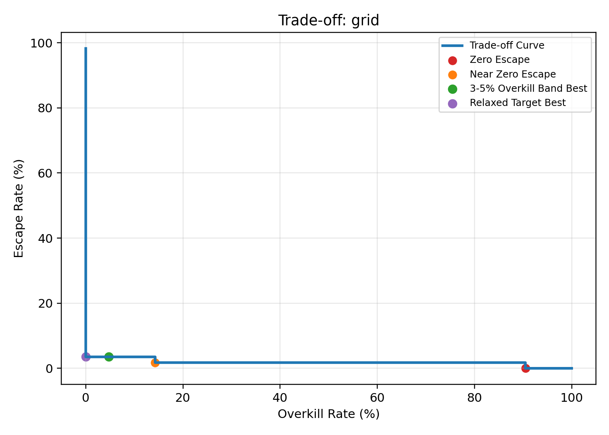
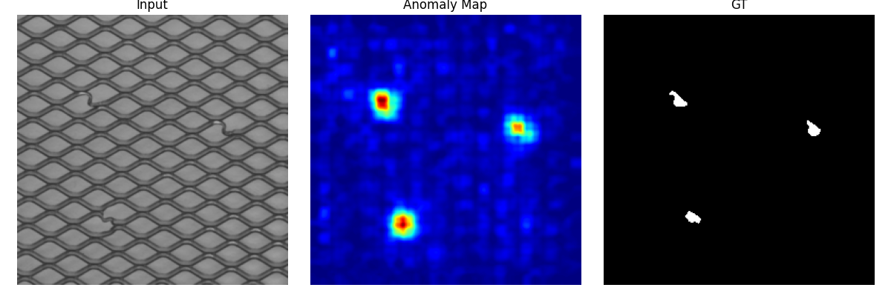

# EfficientAD-Industrial(基于EfficientAD的无监督半导体晶圆表面缺陷检测系统 )


> **"Zero Escape is expensive. We optimize for the Trade-off."**

本项目实现了一个面向半导体产线的无监督晶圆缺陷检测系统。基于 **EfficientAD** 架构，使用MVTec AD (Grid / Transistor)数据，引入了 **Multi-scale Feature Distillation** 与 **Synthetic Anomaly Training**，在仅使用良品训练的情况下，实现了对微小纹理缺陷（Grid/transistor）的高精度检测。

## 核心指标 (Key Metrics)

| Metric | Result (Grid) | Description |
| :--- | :--- | :--- |
| **Image AUROC** | **98.16%** | 图像级分类准确度 |
| **Pixel AUROC** | **97.58%** | 缺陷定位准确度 |
| **Overkill Rate** | **4.76%** | 在漏检率 (Escape) 控制在 3.5% 时的误杀率 |

## 结果展示 (Results Show)

### 1. 产线权衡曲线 (Trade-off Curve)
下图展示了在不同阈值下漏检率与过杀率的关系：



### 2. 缺陷定位 (Localization)
能够精准定位极微小的 **金属污染 (Metal Contamination)** 和 **断裂 (Broken)** 缺陷：

| Input | Anomaly Map | Ground Truth |
| :---: | :---: | :---: |
|  | (See Repo) | (See Repo) |

*(更多可视化结果请查看 `output/vis/` 目录)*

## 快速开始 (Quick Start)

### 1. 安装依赖
```bash
pip install torch torchvision --index-url https://download.pytorch.org/whl/cu118
pip install -r requirements.txt
```

### 2. 训练 (Train)
```bash
python main.py --mode train --class_name grid --batch_size 8
```

### 3. 产线分析 (Production Analysis)
```bash
python main.py --mode analysis --class_name grid --adaptive_k 3.0
```

## 技术亮点 (Highlights)
- **Multi-scale Distillation**: 融合 ResNet18 Layer 1-3 特征，解决小目标漏检问题。
- **Hard Mining Strategy**: 训练时自动聚焦“最难学”的正常纹理，降低误报。
- **Memory Bank Refinement**: 引入特征库检索机制，修正边缘区域的误判。

---
*Created by [Your Name/Team]*
